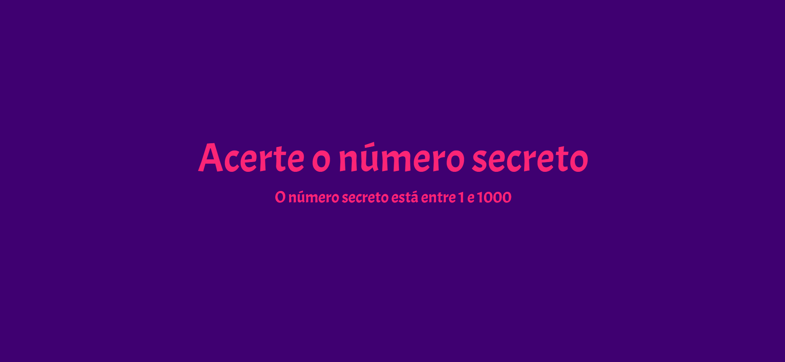
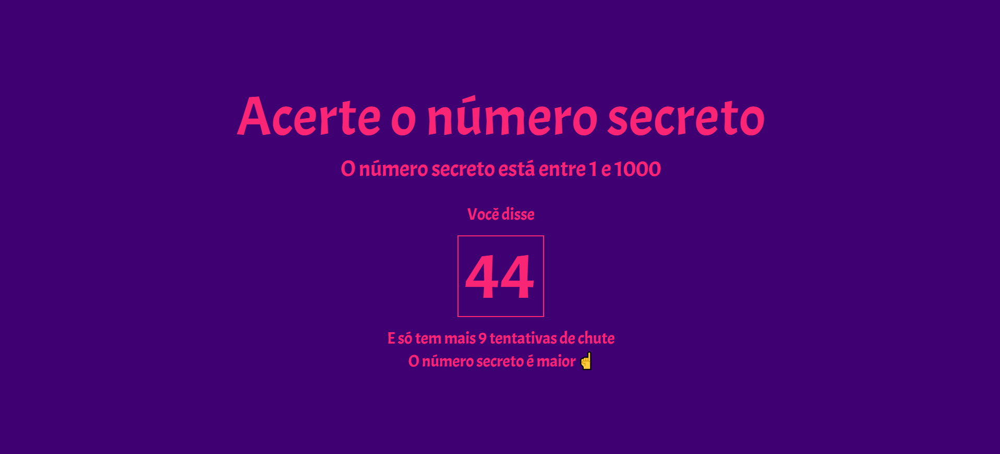
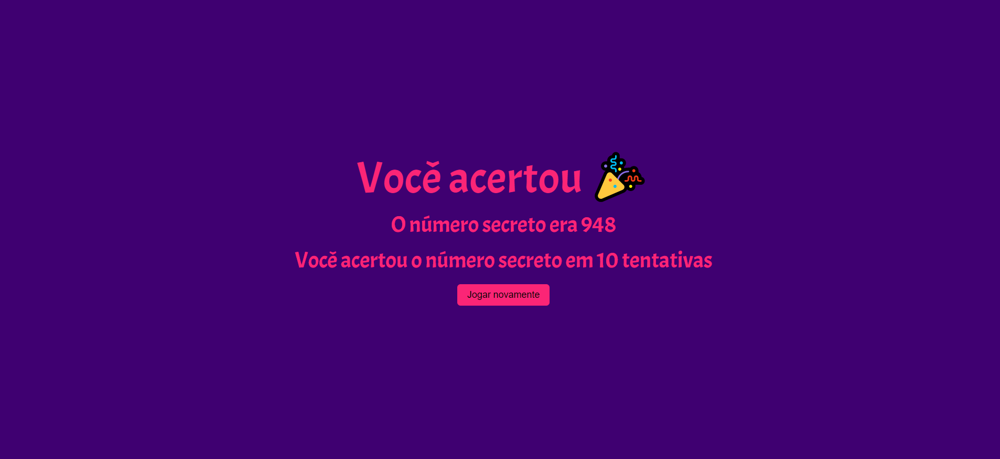

<<<<<<< HEAD
# 🎮 Número Secreto

## Descrição do Projeto

Um game que usa comando de voz. Neste jogo, um número é gerado de forma aleatória e você deve acertá-lo em 10 tentativas. Após falar o número, a tela irá dizer se aquele número está próximo ou distante do número que foi gerado aleatóriamente.

## 🎨 Layout

  

  

  

  

## 🛠 Tecnologias

As seguintes ferramentas foram usadas na construção do jogo:

- [Javacript]
- [HTML]
- [CSS]
- [Web Speech API]